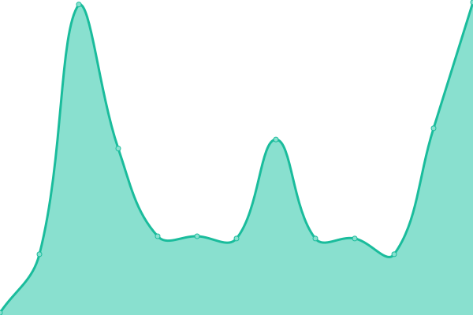

# [📈 Live Status](https://status.ops.neta.mx): <!--live status--> **🟧 Partial outage**

This repository contains the open-source uptime monitor and status page for [Upptime](https://upptime.js.org), powered by [Upptime](https://github.com/upptime/upptime).

With [Upptime](https://upptime.js.org), you can get your own unlimited and free uptime monitor and status page, powered entirely by a GitHub repository. We use [Issues](https://github.com/NetaMx/upptime/issues) as incident reports, [Actions](https://github.com/NetaMx/upptime/actions) as uptime monitors, and [Pages](https://status.ops.neta.mx) for the status page.

<!--start: status pages-->
<!-- This summary is generated by Upptime (https://github.com/upptime/upptime) -->
<!-- Do not edit this manually, your changes will be overwritten -->
<!-- prettier-ignore -->
| URL | Status | History | Response Time | Uptime |
| --- | ------ | ------- | ------------- | ------ |
|  [NetaMx Site](http://18.116.153.81:5050) | 🟩 Up | [neta-mx-site.yml](https://github.com/NetaMx/upptime/commits/HEAD/history/neta-mx-site.yml) | 

 52ms
     
 | 

<a href="https://status.ops.neta.mx/history/neta-mx-site">100.00%</a>
    

|  [API Gateway](https://xkxzvljbtd.execute-api.us-east-2.amazonaws.com) | 🟥 Down | [api-gateway.yml](https://github.com/NetaMx/upptime/commits/HEAD/history/api-gateway.yml) | 

 142ms
     
 | 

<a href="https://status.ops.neta.mx/history/api-gateway">99.83%</a>
    

|  [Api ops](https://api-ops-prod.neta.mx:3013) | 🟩 Up | [api-ops.yml](https://github.com/NetaMx/upptime/commits/HEAD/history/api-ops.yml) | 

 163ms
     
 | 

<a href="https://status.ops.neta.mx/history/api-ops">100.00%</a>
    

<!--end: status pages-->

[**Visit our status website →**](https://status.ops.neta.mx)

## 📄 License

- Powered by: [Upptime](https://github.com/upptime/upptime)
- Code: [MIT](./LICENSE) © [Upptime](https://neta.mx)
- Data in the `./history` directory: [Open Database License](https://opendatacommons.org/licenses/odbl/1-0/)
